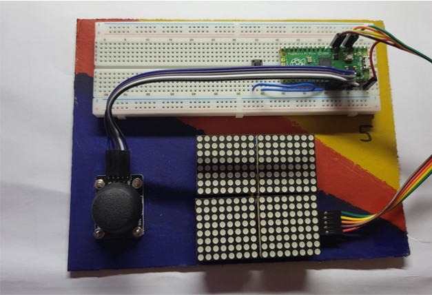
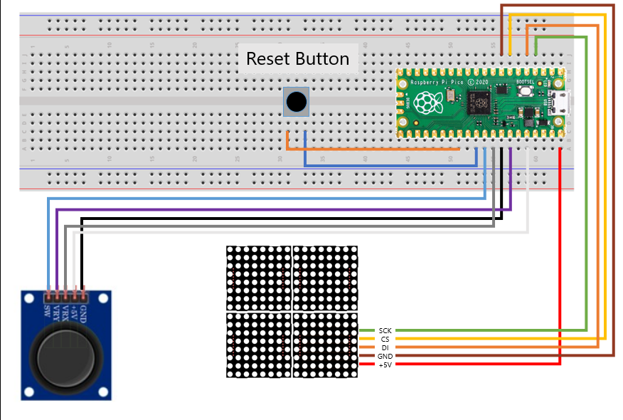
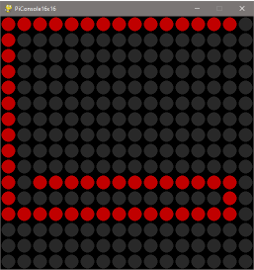
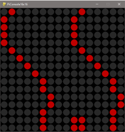
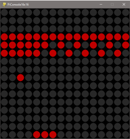

# PiConsole16x16 🎮

**PiConsole16x16** is a compact, Python-powered gaming console built around the Raspberry Pi Pico and a 16×16 LED matrix display. Designed for educational use, it helps learners explore programming, electronics, and game development through hands-on fun.

---

## 🔧 Hardware Overview

- **Microcontroller**: Raspberry Pi Pico
- **Display**: 16×16 RGB LED matrix
- **Input**: joystick
- **Power**: via USB port
- **Extensions**: space available on Breadboard

  
_PiConsole16x16 in action_

  
_Wiring diagram and hardware layout_

---

## 🎮 Available Games

Each game is designed for the 16×16 display.

| Game         | Description                            | Preview                          |
| ------------ | -------------------------------------- | -------------------------------- |
| **Snake**    | Classic snake game with pixel movement |        |
| **Race**     | Dodge obstacles as you race forward    |          |
| **Breakout** | Bounce the ball to break bricks        |  |

---

## 🚀 Installation Instructions

1. **Download the code**  
   Clone or download this repository to your computer.

2. **Install MicroPython on your Pico**  
   Follow [this guide](https://www.raspberrypi.com/documentation/microcontrollers/micropython.html) to flash MicroPython onto your Raspberry Pi Pico.

3. **Upload the game library**  
   Copy `PyConsole16x16.py` to the Pico using [Thonny](https://thonny.org/) or another MicroPython IDE.

4. **Connect the hardware**  
   Wire the Pico to the LED matrix as shown in the schematics. Wires are correctly connected.

5. **Upload a game**  
   Open the a game with Thonny and save it as main.py on your Pico to run it.

---

## 🖥️ Emulator Available

Want to test without hardware? A **console emulator** is included in the `simulator/` directory. It mimics the LED display and input controls via the mouse so you can run and debug games directly on your PC.
